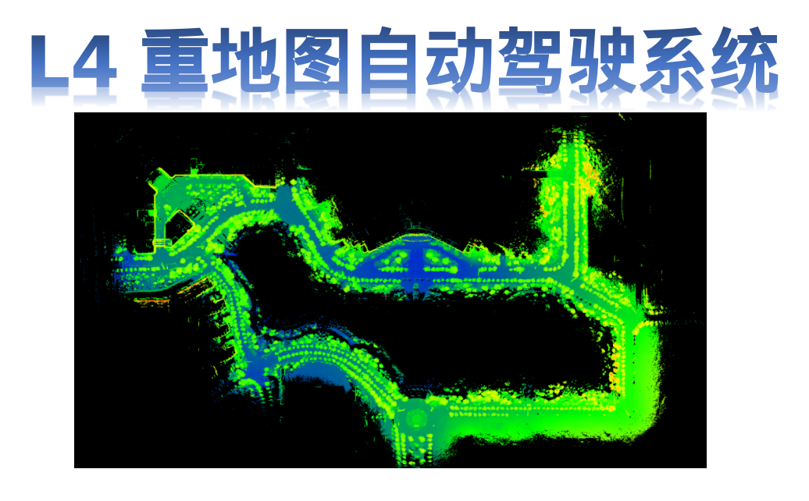

#Autonav-Atlas

     
    
     

    

**Overview**
Autonav-Atlas is an open-source autonomous driving system project based on high-precision maps. It aims to provide a scalable and modular platform for researching, communicating, and developing autonomous driving technologies.

## Features

- [Feature 1]
- [Feature 2]
- [Feature 3]

🎉patent or paper🎉 

## Latest News
The stable version will be formed on November 31, 2023. No updates will be made for now.

## System Architecture
This system consists of two independent subsystems: lidar perception and conventional planning.
The lidar perception subsystem is used for xxx.
The conventional planning subsystem is used for xxx.
## lidar_perception

- **Description：** This is the description of lidar_perception project.
- **Maintainer：** John Doe
- **Repository Link：** [lidar_perception](https://github.com/SonicAutoDrive/High_Automation/lidar_perception)

## Getting Started
1. Step 1...
2. Step 2...
3. Step 3...

### Prerequisites
- [Prerequisite 1]
- [Prerequisite 2]
- [Prerequisite 3]

## conventional_planning

- **Description：** This is the description of conventional_planning project.
- **Maintainer：** Jane Smith
- **Repository Link：** [conventional_planning](https://github.com/SonicAutoDrive/High_Automation/conventional_planning)

## Getting Started
1. Step 1...
2. Step 2...
3. Step 3...

### Prerequisites
- [Prerequisite 1]
- [Prerequisite 2]
- [Prerequisite 3]

### Installation
1. Clone the repository:
git clone https://github.com/SonicAutoDrive/autonav-atlas.git

code

2. Install dependencies:
cd [repository]
pip install -r requirements.txt

### Usage
Provide instructions on how to use the project, including any configuration options and sample commands.

## License

GraphScope is released under [Apache License 2.0](https://www.apache.org/licenses/LICENSE-2.0). Please note that third-party libraries may not have the same license as GraphScope.
